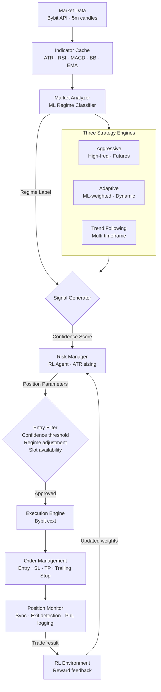

# Algorithmic Crypto Trading System

A live-trading cryptocurrency futures system I built around **market regime classification**, a **reinforcement learning risk agent**, and three independent strategy engines running in parallel.

---

## Background

This project started from a failed attempt at price prediction.
The VBO strategy itself works successfully, and we have confirmed some profit, but we want to further advance the strategy and leap into the realm of precise quantities

Before this system, I spent several months building a full ML pipeline — 72-feature extraction (including physics-inspired metrics like price velocity, acceleration, and entropy), Triple Barrier labeling from Lopez de Prado's *AFML*, LSTM + Attention trained on 7GB+ of data via memory-mapped arrays, XGBoost per-coin ensembles, and a Streamlit dashboard with real-time inference. The stack was technically complete.

The problem was that it didn't work in production. In-sample accuracy looked reasonable. Out-of-sample, predictions degraded toward random. The issue wasn't the engineering — it was the framing. Predicting the 'direction' of future prices assumes the market has stable patterns that repeat. It mostly doesn't.

That failure led to the reframe behind this system: instead of asking "where is the price going?", ask "what state is the market in right now?" Regime classification doesn't require predicting the future. It identifies the current environment and adjusts strategy and risk accordingly.

This is the system that came out of that pivot.

---

## How It Works

Most retail bots apply a fixed strategy regardless of market conditions. This system first classifies the current market regime, then routes each trade through a strategy and risk engine calibrated for that regime.

---

## Core Components

### Market Regime Classifier

Classifies the current market into one of five regimes using a trained ML model (scikit-learn). Each regime has a distinct entry policy — not just a different threshold, but a different posture toward risk.

| Regime | Description | Entry Policy |
|--------|-------------|--------------|
| `STRONG_BULL` | Clear uptrend, strong momentum | Aggressive long bias |
| `WEAK_BULL` | Mild uptrend, mixed signals | Moderate long bias |
| `SIDEWAYS_QUIET` | Low volatility ranging | High-confidence signals only |
| `SIDEWAYS_CHOPPY` | High volatility, no direction | Very high threshold, reduced size |
| `STRONG_BEAR` | Clear downtrend | Short bias |

The regime label feeds into both the signal generator (entry threshold adjustment) and the risk manager (position sizing).

### Signal Generator

Computes a directional confidence score by aggregating weighted technical indicators. Only signals above a regime-specific threshold proceed to the risk manager.

The thresholds aren't fixed values — they're additive adjustments on top of a base. This means SIDEWAYS regimes demand substantially stronger evidence before entering, while STRONG regimes allow the system to be more responsive. The exact adjustment magnitudes aren't published here, but the logic is documented in the Development Log.

### Reinforcement Learning Risk Agent

A custom RL agent (PyTorch, PPO) trained on historical trade outcomes dynamically adjusts position sizing parameters per trade. It learns from the live reward signal: trades that go well reinforce the parameter combination used; trades that don't penalize it.

The agent doesn't make entry decisions — the signal generator does that. It controls *how* to size and structure a position once entry is approved.

### Execution Engine

Handles all exchange interaction via `ccxt`. The main engineering challenge here was Bybit's lack of an order modify API — every stop-loss update requires cancel + re-submit. Early versions called `cancel_all_orders()` for simplicity, which silently cancelled take-profit orders as a side effect. This was a silent failure: TP was configured and appeared to be set, but was wiped on every trailing stop update.

The fix was switching to individual order ID-based cancellation. Details in the [Development Log](./DEVELOPMENT_LOG.md).

### Risk Manager

ATR-based position sizing with a multi-stage trailing stop. The stop tightens as a position moves into profit, locking in gains progressively rather than holding a fixed stop throughout the trade.

---

## Three Strategy Engines

| Strategy | Approach | Design Goal |
|----------|----------|-------------|
| **Aggressive** | High-frequency, futures-focused | Compound small consistent wins; fast scan cycle |
| **Adaptive** | ML-weighted indicator scoring | Regime-aware signal strength; adjusts to current conditions |
| **Trend Following** | Multi-timeframe confirmation | Capture larger directional moves; wider stops |

The three systems are designed to be loosely uncorrelated — when Aggressive underperforms in choppy conditions, Trend Following may be capturing longer moves. Diversification at the strategy level, not just the coin level.

---

## Engineering Notes

**Order management without `modify`**
Bybit doesn't support order modification. Every stop update is cancel + resubmit. Calling `cancel_all_orders()` is the simple path — it's also wrong if you have a take-profit order you want to keep. Spent time debugging why configured TP orders weren't filling before tracing it back to this. Now use ID-based individual cancellation everywhere. Full writeup in [Development Log](./DEVELOPMENT_LOG.md).

**Regime-conditional entry thresholds**
A fixed confidence threshold treats all market regimes equally. Sideways markets generate signals at the same raw confidence levels as trending markets — but those signals are far less reliable. The solution was additive per-regime adjustments that demand progressively stronger evidence in noisier environments.

**Confidence-sorted entry queue**
When multiple symbols generate entry signals simultaneously and position slots are limited, candidates are sorted by confidence score. Highest confidence fills first — not whichever signal arrived first.

**Live auto-retraining**
The system monitors rolling performance metrics and triggers a model retraining cycle automatically under certain conditions (e.g., extended drawdown). This is separate from the RL agent's online learning — it's a full retrain of the regime classifier and indicator weights.

**Daily circuit breakers**
Two independent safety limits: daily drawdown limit and consecutive loss limit. Both pause trading when triggered and reset at UTC midnight.

---

## Tech Stack

| Layer | Technology |
|-------|-----------|
| Language | Python 3.12 |
| Exchange API | ccxt (Bybit Futures) |
| ML / RL | scikit-learn (regime classifier), PyTorch (RL agent) |
| Data | pandas, numpy, Parquet |
| Notifications | Telegram Bot API |
| Infrastructure | AWS EC2, nohup process management, cron scheduling |

---

## Development Log

All design decisions, bugs found in production, and lessons learned are documented in [DEVELOPMENT_LOG.md](./DEVELOPMENT_LOG.md).

The log is structured around a problem → hypothesis → solution → result → learning format. It covers both this system and the predecessor ML pipeline. The goal is to show not just what was built, but why each decision was made and what it cost to figure out.

---

## Status

Live since early 2026. Clean performance data collection started after fixing the order management bug described above. Regime-stratified performance analysis is planned once sufficient clean data has accumulated.

The Adaptive and TrendFollowing systems are in development. The architecture is shared; the signal logic and risk parameters differ.

---

*Strategy parameters, signal thresholds, trained model files, and indicator weights are not published in this repository.*
*This repo contains the system architecture and documented development process.*
